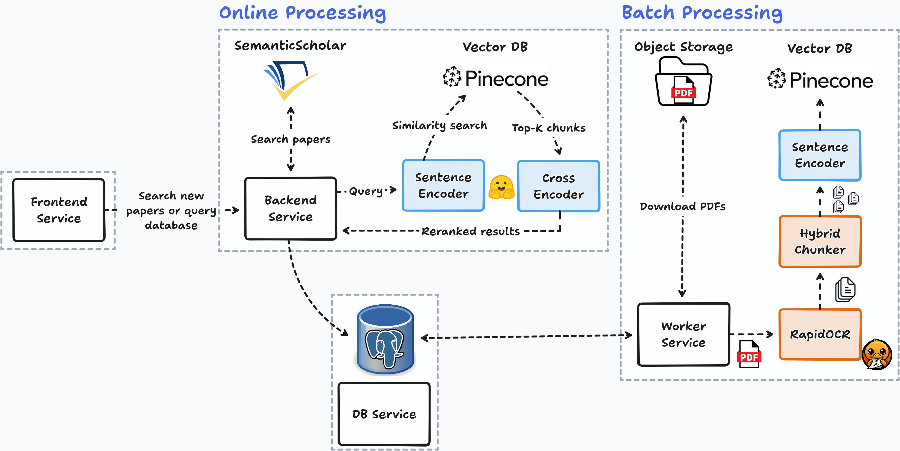

  

<h1 align="center">Papers, Please! 
</h1>

    A system to fetch scientific papers PDFs, and perform semantic search on their contents.  

  <a href="https://store.steampowered.com/app/239030/Papers_Please/"> 🎮 Papers, Please (the great game whose branding we ripped off for this otherwise unrelated personal project) 

## Demo 

(Todo)

## Usage

First, configure your secrets (example provided at `.env.example`)

Then, just `docker-compose up` and you should be good to go. 

## Architecture 

System is split into 4 services

- Frontend: Built with React with the help of Claude
- Backend: 
  - REST API using FastAPI
  - `fetch` new paper metadata using [SemanticScholar's API](https://www.semanticscholar.org/)
  - `query` registered papers, enabling user to search inside PDFs
- Worker:
  - Performs slow batch processing tasks
  - Download paper PDFs automatically 
  - Extract text from PDF with [RapidOCR](https://github.com/rapidai/rapidocr)
  - Chunk text with [Docling](https://www.docling.ai/) `HybridChunker`
  - Embeds chunks and indexes to [PineCone vector DB](https://www.pinecone.io/)
- Postgres DB

## Limitations

Worker service is essentialy a cronjob which polls DB for pending PDFs, sequentially process a batch (Download -> OCR -> Chunk -> Embed), and requeues any failed documents.

At scale this is not ideal, because it creates a coupling between online tasks (backend service) and batch tasks: both keep hitting the same DB. 

I'd like in the future to add something like Redis for the worker service, replacing this polling mechanism.

## Development

If you are on Nix, just `nix develop` to get the development shell from the flake. Optionally, `direnv allow` to automatically activate the shell when you `cd` in the project folder.  

If you are a normal healthy person, use the amazing [uv package manager](https://docs.astral.sh/uv/) to create a virtual environment with everything you need (for backend).
