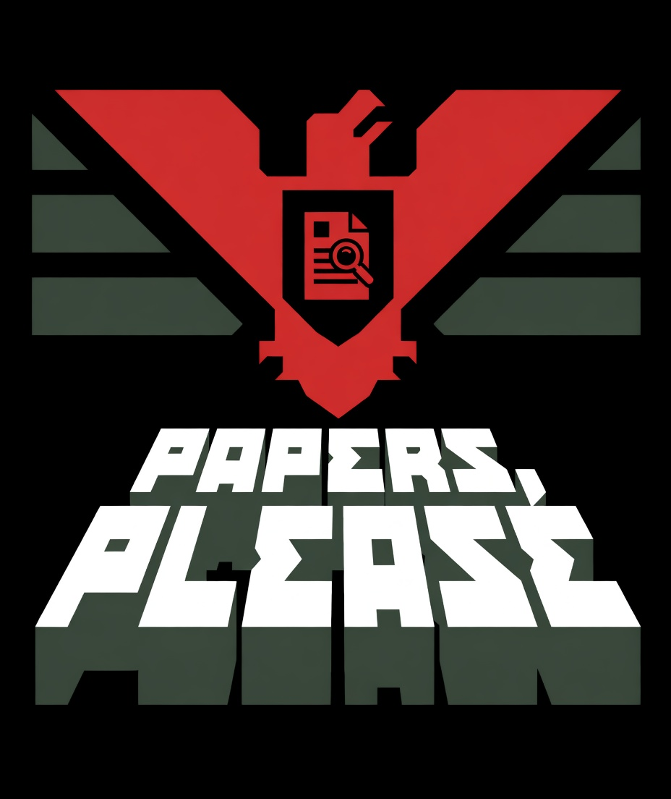
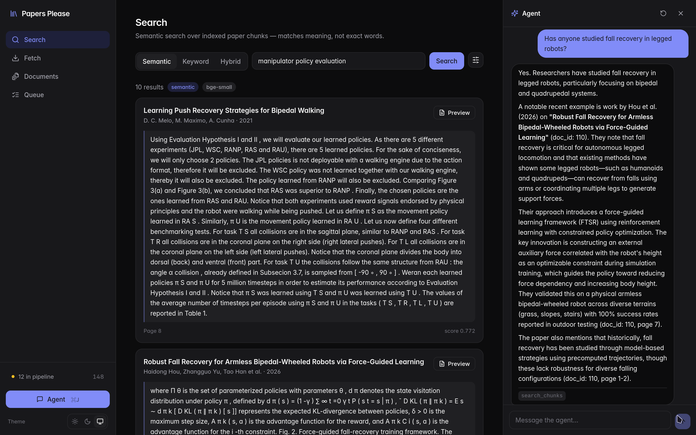
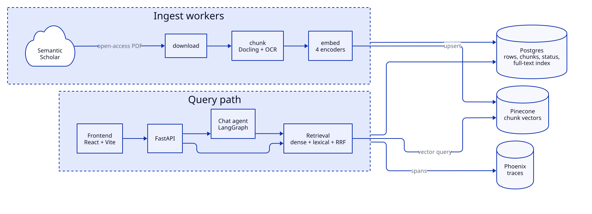

# Papers, Please

  

Papers, Please pulls scientific papers from Semantic Scholar, OCRs the PDFs,
chunks and indexes the text, and searches over it. You can run a query
against the full contents of every paper in the library, or ask a question in
the chat panel and get an answer that cites the document and page it came
from.

## Demo

<!-- TODO: replace the screenshot with the video, or with a thumbnail that links to it. -->

  
   
  <em>Video demo goes here. Screenshot of the search view and the agent panel until then.</em>

## Why I built it

Deciding whether a paper is worth reading usually means reading the abstract,
and an abstract is written to sell the paper. What I actually want is a number
in a results table, the baseline someone picked, an ablation, or a sentence
about why a method did not work, and none of that survives into the summary.
Searching abstracts finds papers that sound relevant and misses papers that
are.

So this indexes the contents instead. Every PDF gets OCR'd and chunked, and a
query hits the methods and results sections along with the abstract. Going
back over papers I already had got faster, and papers I did not know to look
for started turning up.

## Stack

Everything runs locally under Podman or Docker Compose. Postgres holds the
metadata and doubles as the queue: there is no broker, and each ingest stage
is its own container polling for rows in the status it handles, so one stage
can be restarted or scaled without touching the others.

  <picture>
    <source media="(prefers-color-scheme: dark)" srcset="assets/architecture-dark.svg">
    
  </picture>

The diagram is generated from [`assets/architecture.d2`](assets/architecture.d2)
with [D2](https://d2lang.com); the render command is in the header of that
file.

| Piece | What it is |
|---|---|
| Fetch | Semantic Scholar API for metadata, filtered to papers with an open-access PDF |
| PDF to text | Docling with RapidOCR, on the GPU, which is where nearly all the ingest time goes |
| Embeddings | sentence-transformers, with bge-small, bge-large, arctic-m-v2 and qwen3-0.6b. Every chunk is stored under all four, so changing encoder does not mean re-ingesting the corpus |
| Retrieval | Pinecone for dense search, Postgres `ts_rank` and `bm25s` for lexical, Reciprocal Rank Fusion for the two hybrids, and an `ms-marco-MiniLM` cross-encoder for optional reranking |
| Chat agent | LangGraph, with four tools: `fetch_papers`, `get_status`, `search_chunks`, `get_document` |
| API | FastAPI and SQLAlchemy over Postgres 16 |
| Frontend | React, Vite, Tailwind, Radix |
| Tracing | Phoenix over OpenTelemetry. Judged eval runs get one trace per question, with the retrieved chunks attached to the spans |
| Evaluation | Ragas for test-set generation and answer judging, plus label-based retrieval metrics that need no model |
| Dev environment | Nix flake, uv, Python 3.14 |

## How to evaluate a RAG system

This is the part of the project I have spent the most time on. The corpus is
100 papers and 11,381 chunks. The question set is 100 questions, generated
with Ragas from a knowledge graph built over the corpus and then curated by
hand, each carrying the chunk ids it came from. Scoring splits in two from
there: retrieval is scored against those chunk ids, which costs nothing and
can be swept exhaustively, and answers are scored by an LLM judge, which
costs money and gets used to confirm or contradict the cheap half.

Write-ups are in progress. Links land here as the posts go out:

<!-- TODO: point these at the posts once they are published. -->

- [Generating a test set from your own corpus, and why it still needs curating](#)
- [Scoring retrieval without calling a model](#)
- [Using an LLM as a judge, and checking the judge against human labels](#)
- [What the sweeps found: BM25 over dense, and every query rewrite losing ground](#)

Until those exist, [`docs/rag-evaluation.md`](docs/rag-evaluation.md) is the
working reference and the figures are under `assets/eval/`.
