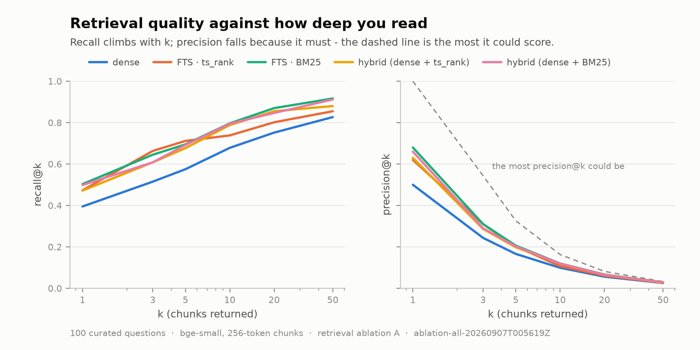
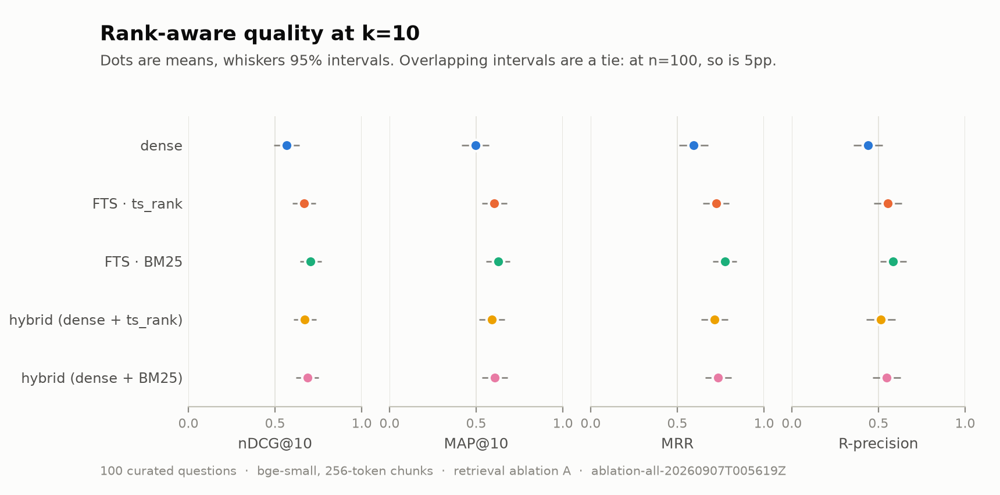
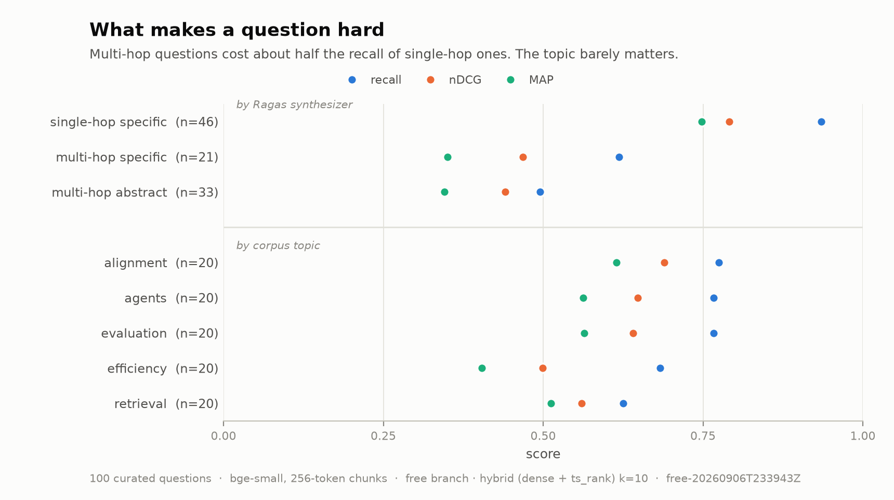
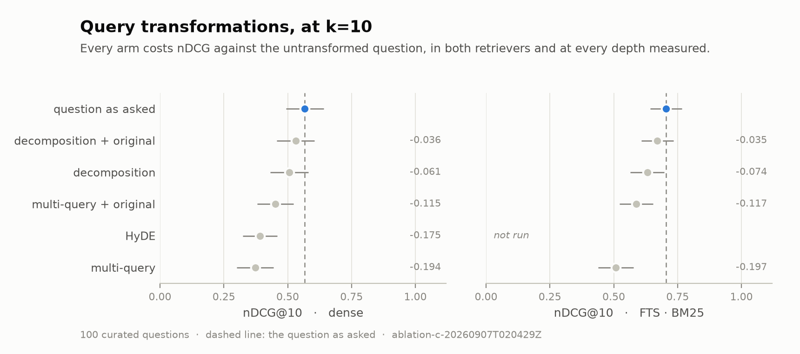
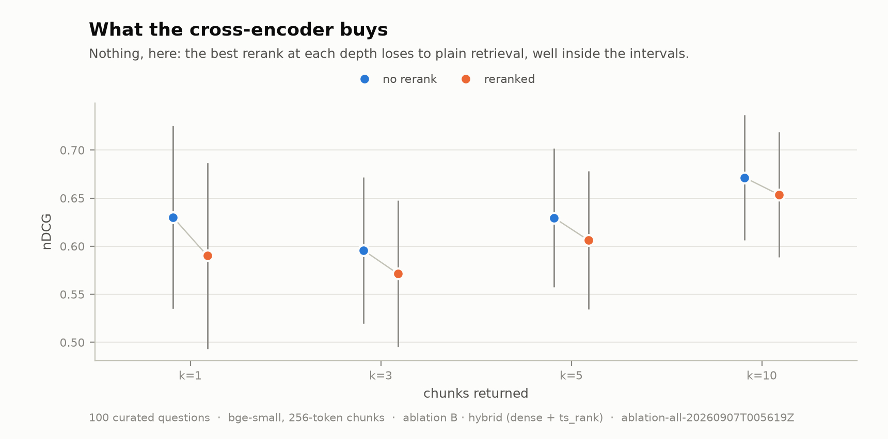
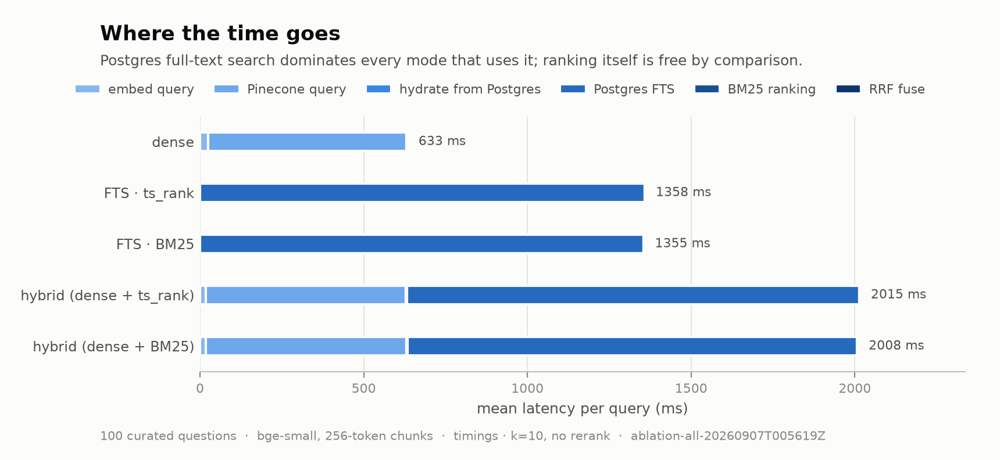
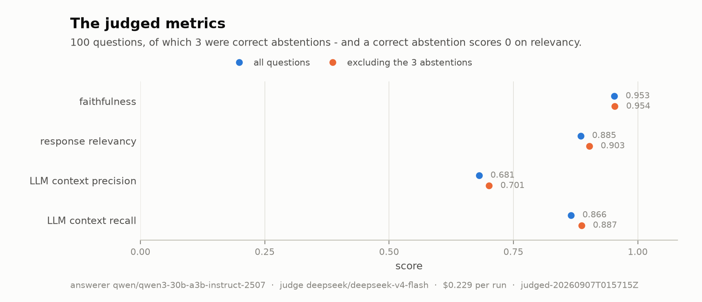
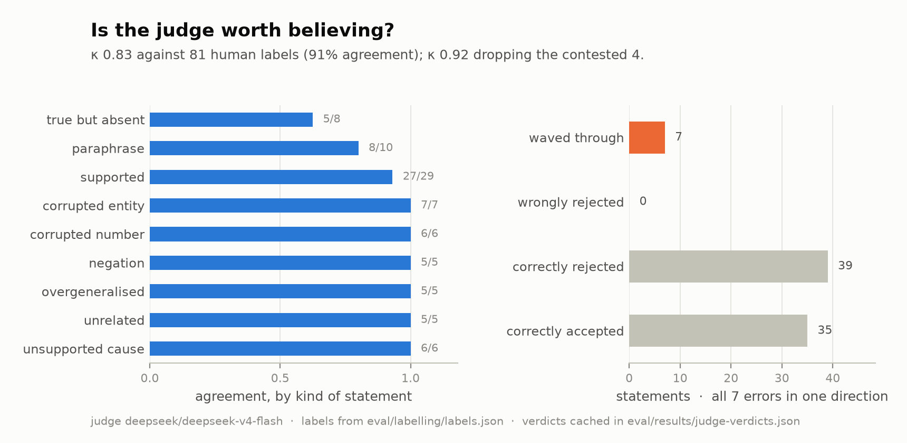

# Papers, Please

<p align="center">
  
</p>

<p align="center">
    Fetch scientific papers, index them, and search or ask questions over your library.
</p>

## What it does

- **Fetch** papers from Semantic Scholar by search query (deduped against what you already have — re-fetching a query you've already run adds nothing, doesn't re-download).
- **Download → OCR/chunk → embed**, automatically, as three independent stage workers polling the DB on their own schedule. No queue service — Postgres row status (`pending` / `chunked` / `failed`) is the coordination mechanism.
- **Search** two ways: semantic (vector similarity via Pinecone, optional cross-encoder rerank) and keyword (Postgres full-text) — same result shape, pick whichever fits the question.
- **Chat with an agent** that does two things: decide what to fetch from a natural-language request, or answer questions using papers already in the library (with citations back to `doc_id`/page). It remembers the conversation (per browser tab). It does *not* decide when to download/chunk/embed — that's deterministic, not an LLM's job.
- **Queue dashboard** — live counts of what's pending at each pipeline stage.

## Architecture

```
Semantic Scholar ──fetch──▶ documents (Postgres)
                                  │
                    ┌─────────────┼─────────────┐
                    ▼             ▼             ▼
              worker-download  worker-chunk  worker-embed   (independent,
                    │             │             │            poll-driven,
                    ▼             ▼             ▼            no queue)
                 PDF files    chunks (PG)   Pinecone vectors
                                              + chunk_embeddings (PG)

FastAPI (api.py) ── /fetch /search /search/keyword /status /documents ──▶ Postgres, Pinecone
                 └── /agent/chat ──▶ orchestrator agent (LangGraph + Claude)
                                       tools: fetch_papers, get_status, search_chunks, get_document

React frontend ── docs-style sidebar (Search / Fetch / Documents / Queue) + floating chat panel
```

Each stage worker is a separate process/container (`stages/download.py`, `stages/chunk.py`, `stages/embed.py`), independently restartable and independently tunable (`config.yaml`'s `stages.*.interval_s`/`limit`). They don't know about each other or about the orchestrator agent — the agent is additive (fetch decisions + retrieval), not a replacement for the pipeline.

See [`docs/mvp-plan.md`](docs/mvp-plan.md) for the subtask-by-subtask build history and the reasoning behind these choices (including a couple of corrections made along the way — worth reading if "why does the agent not control downloading" seems like an odd design choice).

## Quickstart

Requires `podman`/`podman-compose` (or Docker Compose — `compose.yaml` is standard).

```bash
cp .env.example .env   # fill in the values below
podman-compose up -d --build
```

Then open **http://localhost:8080**.

### `.env`

| Var | Needed for |
|---|---|
| `POSTGRES_USER` / `POSTGRES_PASSWORD` / `POSTGRES_DB` | Postgres (documents, chunks, pipeline state) |
| `PINECONE_API_KEY` | Vector storage/search (free tier is enough — one small index) |
| `ANTHROPIC_API_KEY` | The chat agent (`/agent/chat`). Everything else works without it. |
| `HF_TOKEN` | Optional — higher Hugging Face rate limits for model downloads |

## Project layout

```
services/
  backend/        FastAPI app, stage workers, orchestrator agent
    stages/       download.py / chunk.py / embed.py - independent poll loops
    orchestrator/ tools.py, graph.py, llm.py - the LangGraph agent
    prompts/      versioned LLM prompts (<name>/v1.md) + registry.py
    ingest/       Semantic Scholar fetch, PDF download
    process/      OCR/chunking (Docling), embedding
    search.py     semantic / keyword / hybrid (RRF) retrieval + rerank
    status.py     pipeline status query (shared by /status and the agent's get_status tool)
  db/             schema.sql
  frontend/       React + Vite + Tailwind + Radix UI, no other framework
```

### What actually gets embedded

A chunk's stored text is its section path plus its body:

```
Methods > Ablation Studies

We ablate the encoder and observe ...
```

Docling strips headings out into metadata and hands back bare body text.
Storing only that made two papers' Methods sections describing the same
technique into near-identical vectors with nothing to tell them apart, and
left queries naming a section ("ablation results") with no term to match.
The prefix is free against the token budget - `HybridChunker` already sizes
chunks by counting its own contextualized form, headings included.

Sections with no retrievable claims (references, acknowledgments, funding,
competing interests, data availability) are dropped at chunk time. A
references section is a packed list of author surnames, so it matches the
keyword retriever for nearly any author or topic query and scores well doing
it - a whole class of confident, useless hits, removed at the source.
Appendices are deliberately kept: they hold ablations and proofs.

Chunks are 256 tokens, half of bge-small's window. A smaller chunk is a
sharper vector - averaging a passage that spans two topics lands the
embedding between both and near neither. The context a generator needs is
recovered *after* ranking instead: `search.neighbour_window` glues the chunks
either side of each surviving hit into a `context` field, while `text` stays
the chunk that actually matched, so the score keeps meaning what it says and
the UI can still show what matched. Expanding before ranking would hand the
cross-encoder a blur of three chunks to score.

Net context per search is roughly flat against the old 512-token chunks
(5 x 256 x 3 vs 5 x 512); the gain is precision, not free tokens.

### Re-indexing after a chunking change

Chunk text and vector metadata are inputs to the embedding, so changing
either makes existing vectors stale. `chunks` is upserted
`ON CONFLICT DO NOTHING` on `(obj_id, chunk_index)`, so re-running the
chunker over already-chunked objects will *not* rewrite their text - the
rows have to go first:

```sql
-- chunk_embeddings and chunks cascade from objects
TRUNCATE chunks RESTART IDENTITY CASCADE;
UPDATE objects SET status = 'pending';
```

```bash
# then re-embed into a fresh index (drops and recreates it)
cd services/backend
uv run python -c "from process.embedder import PdfEmbedder; PdfEmbedder().execute(recreate_index=True)"
```

The stage workers pick the objects back up on their next poll. Budget OCR
time, not tokens - none of this calls an LLM.

## Running it without an API key

The agent panel works end to end with no `ANTHROPIC_API_KEY`, no Postgres and
no Pinecone:

```bash
PAPERS_PLEASE_REPLAY=1 docker compose up
```

Replay swaps **both** ends of the agent loop for recorded fixtures in
`services/backend/eval/replay/` — the model that decides and the tools that
fetch. The LangGraph graph itself still runs for real, so the tool-calling
loop, the checkpointer, the message sequence, and everything downstream that
reads it are exercised exactly as in production. A bug in how a tool result
becomes a citation is catchable here; a bug in retrieval quality is not.

Scripted questions:

| Ask about | Exercises |
|---|---|
| *fall recovery* in legged robots | one search, an answer citing two papers |
| transformer *attention* | two searches — the first query is too broad and gets refined |
| *protein folding* | abstention: nothing relevant, and the agent says so |
| *federated learning* | a fetch request, status checked first |
| *muscle synergy* | a tool failure, reported rather than papered over |

Anything else falls through to `_fallback.json`, which explains itself rather
than dead-ending. Fixtures are hand-authored, not recorded from a live run —
recording would spend the tokens this exists to avoid, and a hand-written
fixture can cover an abstention or a tool failure that is awkward to provoke
on demand.

`llm.provider: replay` in `config.yaml` does the same thing; the environment
variable wins, so it can override a checked-in config.

## Models and OpenRouter

The app talks to **OpenRouter** by default: one OpenAI-compatible endpoint
fronting every provider, so "which model" is a config string rather than a
code change. That is what makes an ablation across models possible at all.

```yaml
# services/backend/config.yaml
llm:
  provider: openrouter          # openrouter | anthropic | vllm
  model: minimax/minimax-m2.7:free
  judge_model: ""               # empty = same as model
```

```bash
OPENROUTER_API_KEY=sk-or-v1-...   # .env
```

Model ids are namespaced `vendor/model`, and a **`:free`** suffix selects
that model's free tier. `provider: anthropic` still goes direct to Claude,
unchanged; you can also reach Claude *through* OpenRouter as
`anthropic/claude-haiku-4.5`, at the same list price.

`judge_model` is deliberately separate from `model`. Changing the model that
*answers* is an experiment; changing the model that *scores* silently
re-baselines every historical number in `eval/ledger.jsonl`. Pin the judge
when you want scores to stay comparable across runs.

### What free models can and cannot do here

Measured, not assumed — 421 models on OpenRouter, 21 free, **18 of those
support tool calling**, which the 4-tool agent requires. Of the ones tried
against the real agent graph:

| model | result |
|---|---|
| `minimax/minimax-m2.7:free` | works, ~6s/turn — the default |
| `openrouter/free` | works, ~7-10s; auto-routes across free models, so it survives any one being rate-limited — but it won't tell you which model answered, which makes it a poor choice for eval |
| `z-ai/glm-5.2:free`, `google/gemma-4-31b-it:free` | HTTP 429 — free capacity is frequently exhausted |
| `nvidia/nemotron-3-super-120b-a12b:free` | HTTP 404 — listed but not actually served |

Two limits worth knowing before planning around free models:

- **They loop on open-ended prompts.** Both working models answered direct
  questions correctly but hit `MAX_AGENT_RECURSION` on *"summarise what you
  know, citing doc ids"* — repeatedly calling the tool without converging.
  The recursion guard catches it, so it degrades to an error rather than a
  runaway bill, but it is a real capability gap against Claude.
- **Free tier rate limits are low.** Enough for the app and for a demo, not
  enough for a 50-question judged eval, which issues several hundred judge
  calls. Use `--sample` and the disk cache, or point `judge_model` at a paid
  model for the runs that go in the ledger.

The judge-free retrieval runs (`eval.run_free`, `eval.ablations`) are
unaffected by any of this — they use no LLM at all.

## Feedback

Every search result and every cited source in an agent answer carries a
thumbs-up/down. A thumbs-up is exactly what `relevant_source_ids` encodes —
*for this question, this paper is relevant* — so it is the cheapest possible
way to grow the eval set, which is otherwise hand-authored in
`eval/fixtures.py`.

```bash
cd services/backend
uv run python -m eval.feedback                  # print proposed dataset rows
uv run python -m eval.feedback --min-votes 2    # only questions marked twice
```

It **proposes** rather than appends, for two reasons. A dataset row also
needs `ground_truth`, which a thumb cannot supply — every proposal comes out
with that field blank, because an invented ground truth would poison every
faithfulness score computed against it afterwards. And feedback is unvetted
input: silently appending would let a stray click move the numbers this
project steers by, with no diff to notice it in.

A thumbs-*down* is not the inverse label and is not turned into one. "This
result is bad" says nothing about which paper would have been good, and
`relevant_source_ids` has no way to record a negative.

Stored in Postgres rather than annotated onto Phoenix spans: Phoenix only
sees LangChain calls, so `/search` produces no span to annotate, and its
volume is disposable dev state that labels have to outlive.

Adding this to an existing database (there is no migration tooling — the DDL
lives in `services/db/schema.sql`):

```sql
CREATE TABLE feedback (
    id SERIAL PRIMARY KEY,
    kind TEXT NOT NULL CHECK (kind IN ('search', 'citation')),
    query TEXT NOT NULL,
    doc_id INT,
    chunk_id INT,
    verdict TEXT NOT NULL CHECK (verdict IN ('up', 'down')),
    note TEXT,
    created_at TIMESTAMPTZ NOT NULL DEFAULT NOW()
);
CREATE INDEX idx_feedback_created ON feedback(created_at DESC);

-- Chunk retry accounting (see "Failed PDFs" below)
ALTER TABLE objects ADD COLUMN attempts INT NOT NULL DEFAULT 0;
ALTER TABLE objects DROP CONSTRAINT objects_status_check;
ALTER TABLE objects ADD CONSTRAINT objects_status_check
    CHECK (status IN ('downloading', 'pending', 'chunked', 'failed', 'dead'));
```

### Failed PDFs

`stages.chunk.max_attempts` (default 3) caps how many times a PDF that
failed to chunk is retried. Past it the object becomes `dead` rather than
`failed` — `failed` means "try again", `dead` means "stop trying", and only
the second is a state the requeue loop can safely leave alone.

Without the cap, `_requeue_failed` flipped every failure back to `pending`
whenever the queue emptied, so a PDF that will never parse was re-OCR'd
forever. Requeueing also kept the queue non-empty, which is the condition
that fires the requeue: one broken file could hold the chunker at 100% CPU
indefinitely. OCR is the most expensive step in the pipeline, so this was
not a small leak.

The Queue page also shows whether the stage workers are actually running,
read from the container runtime (`GET /workers`), with each worker's recent
logs expandable in place. Counters say how much work is left; that strip
says whether anything is doing it — a full backlog and a stopped worker
looked identical before, which is how a stopped `worker-download` got
reported as a broken pipeline. It needs the podman/docker socket mounted
read-only into the backend (see `compose.yaml`); without it the strip says
so rather than claiming the workers are down.

The Queue page lists what is actually in flight — each paper, its stage, its
chunk/embedding progress and its attempt count — with anything that needs
attention sorted to the top.

## Evaluation

Retrieval is measured against a **100-question curated set** generated with
Ragas from the project's own chunks and mapped back to exact chunk ids, over a
corpus of **5 topics × 20 arXiv papers** chosen to interfere with each other.
The design — why few topics deep, why the chunk-id mapping matters, and what
each metric can and cannot tell you — is in
[`docs/rag-evaluation.md`](docs/rag-evaluation.md).

Two branches. The **free** branch scores retrieval by set arithmetic on integer
chunk ids: no LLM, no cost, run it on every change. The **paid** branch scores
the generated answer with a judge, and costs about 23¢ per run.

Every figure below is regenerated from cached results by one command
(`python -m eval.figures`), in light and dark, and carries the run it came from
in its footer.

### How deep to read, and what precision can even mean

<picture>
  <source media="(prefers-color-scheme: dark)" srcset="assets/eval/png/retrieval-depth-dark.png">
  
</picture>

Recall keeps climbing with k. Precision falls — and the dashed line is why:
most questions in this set have one or two relevant chunks, so precision@10
**cannot exceed ~0.16** however good the retriever is. Precision@k here is
mostly arithmetic, which is the argument for reading nDCG and MAP instead and
demoting precision to a footnote.

<picture>
  <source media="(prefers-color-scheme: dark)" srcset="assets/eval/png/ranking-quality-dark.png">
  
</picture>

Every reported number carries a 95% interval, and at n=100 those intervals are
wide: a five-point gap is not a result. BM25 over the Postgres FTS candidates
leads, dense trails, and the two hybrids sit between — but most of those gaps
are inside the intervals and should be read as ties.

### Where the difficulty actually lives

<picture>
  <source media="(prefers-color-scheme: dark)" srcset="assets/eval/png/question-difficulty-dark.png">
  
</picture>

Not in the topic — in the question. Single-hop questions score 0.94 recall;
multi-hop abstract ones score 0.50. The five topics are within a few points of
each other. A headline retrieval number is really a statement about the mix of
question types underneath it.

### Three things that did not work

<picture>
  <source media="(prefers-color-scheme: dark)" srcset="assets/eval/png/query-arms-dark.png">
  
</picture>

**Query transformation.** HyDE, multi-query and decomposition all cost nDCG
against simply using the question as asked — in both retrievers and at every
depth measured. Keeping the original question alongside the rewrite recovers
part of the loss but never clears the baseline.

<picture>
  <source media="(prefers-color-scheme: dark)" srcset="assets/eval/png/rerank-matched-dark.png">
  
</picture>

**The cross-encoder.** Compared at *matched output size* — reranking a
40-candidate pool down to k against plainly returning k — the best rerank
configuration loses at every depth. The intervals overlap, so the honest
reading is "no measurable gain", not "it hurts".

The score floor is the third: `min_rerank_score` moves mean results returned
from 10.00 to 9.93 at its most aggressive setting. Every question in this set
has a relevant chunk, so there is nothing to abstain from and the abstention
axis has no purchase here.

### What it costs to run

<picture>
  <source media="(prefers-color-scheme: dark)" srcset="assets/eval/png/latency-breakdown-dark.png">
  
</picture>

Postgres full-text search dominates every mode that touches it, and fusion pays
for both sides. The ranking functions themselves — BM25, RRF — are free by
comparison. `assets/eval/png/latency-quality-*.png` plots the same numbers
against nDCG as a trade-off curve.

### The judged branch, and whether the judge can be trusted

<picture>
  <source media="(prefers-color-scheme: dark)" srcset="assets/eval/png/judged-metrics-dark.png">
  
</picture>

Reported twice, with and without the three correct abstentions: response
relevancy scores a correct abstention **0** by construction, so letting them sit
in the mean punishes the pipeline for behaving well.

<picture>
  <source media="(prefers-color-scheme: dark)" srcset="assets/eval/png/judge-agreement-dark.png">
  
</picture>

Every judged number above rests on the judge being right, so it was checked
against 81 human labels: **Cohen's κ 0.83**, 91% agreement. The error direction
matters more than the rate — all seven mistakes are unsupported statements the
judge waved through, none are supported statements it rejected. The judge's bias
is toward *missing* hallucinations, so faithfulness above should be read as an
upper bound.

Finally, `assets/eval/png/exact-vs-ragas-*.png` puts the exact chunk-id scoring
beside Ragas' own non-LLM string matching. Both treat the seed chunks as the
complete relevant set, so both are lower bounds; they agree on recall and part
ways on ordering.

### Running it

Two tiers, and the cheap one is the default loop. Retrieval quality is a
ranking property measurable against labels, so it needs no LLM at all; reach
for the judge only when the question is about the *generated answer*, which is
the one thing labels can't score.

```bash
cd services/backend

# Tier 1 - free. No LLM anywhere, so run it as often as you like: retrieval is
# scored by exact set arithmetic on chunk ids against the curated question set.
uv run python -m eval.run_free                   # one config, the shipped one
uv run python -m eval.run_free --mode bm25 --top-k 20
uv run python -m eval.ablations all              # every axis -> eval/results/ablation-all-*.json
uv run python -m eval.ablations c                # just the query-transformation arms

# Tier 2 - costs real API tokens: one call per question for the answer, plus
# several judge calls per metric per question.
uv run python -m eval.run --sample 15            # iterating
uv run python -m eval.run                        # full run, for the ledger
uv run python -m eval.judge_kappa                # judge vs the human labels (cached)

# Figures. Reads only the cached JSON above - no search, no embedding, no LLM.
# matplotlib is a --with extra rather than a project dependency.
uv run --with matplotlib python -m eval.figures
uv run --with matplotlib python -m eval.figures --only query-arms judged-metrics
```

Figures land in `assets/eval/png/` and `assets/eval/svg/`, two files per
figure (`-light` and `-dark`), wired into this README with `<picture>` +
`prefers-color-scheme`. A figure whose ablation is missing from the cache is
skipped with a reason rather than failing the run, so a partial re-run still
regenerates everything it can.

`--sample N` scores a stratified subset (category x domain, seeded - the same
N is the same N every time), so iterating doesn't cost a full run. Judge calls
are memoised under `eval/.judge-cache/`, so re-running an unchanged dataset
re-reads instead of re-paying; `--no-cache` forces fresh verdicts.

Every judged run reports what it spent - `89,412 in / 12,004 out tokens -
$0.15` - in the report, the ledger, and the summary table's `cost` column. A
score with no cost beside it is how a 50-question run quietly grows into a
1M-token one.

Every run appends a line to `eval/ledger.jsonl` (committed), and
`eval.summary` renders it as one table covering judged and retrieval runs
together, plus the precision-recall operating curves. The ledger is the durable
record - `eval/results/*.json` is gitignored scratch, so a run still shows in the
table after its raw output is cleaned up.

Retrieval metrics are also recorded by the judged run, so a report says whether a
bad answer came from retrieval missing the paper or from the model ignoring it -
the judge metrics alone can't tell those apart.

Questions where nothing in the library is relevant ("does this cover X?" - it
doesn't) are scored separately as abstention, not as recall failures: averaging a
zero into recall for correct behaviour would misreport it.

Defaults that came out of the ablations rather than out of taste: `search.mode:
hybrid` and `keyword_weight: 1.0`. That weight was `0.1` until the current
corpus was measured — fitted on the old 12-document one, where dense was the
stronger ranker. On this corpus the fusion curve is monotonic the other way
(nDCG 0.608 at 0.1 against 0.671 at 1.0), because at 0.1 a rank-1 keyword hit
scored below a rank-40 dense hit and so could not outrank dense anywhere in the
pool. The figure above is that curve.

`min_rerank_score: -8.0` is retained but currently inert: on the curated set it
moves mean results returned from 10.00 to 9.93, because every question there has
a relevant chunk. It is in the cross-encoder's logit units and specific to
`ms-marco-MiniLM-L-6-v2` — swapping `search.reranker_model` invalidates it, so
re-run `eval.ablations b`.

## Testing

```bash
cd services/backend
uv run pytest              # fast, mocked - default
uv run pytest -m integration   # real Postgres (disposable podman container) + real Pinecone (isolated test namespace)

# The eval harness imports ragas, whose executor calls nest_asyncio.apply()
# at import time and poisons the event loop for the TestClient tests - so
# these run in their own process.
uv run pytest -o addopts="" tests/test_eval_run.py tests/test_eval_sampling.py -m eval

cd ../frontend
npm test                   # node --test, built in - no test dependency
```

Every subtask that touches the DB/Pinecone/search has both: mocked unit tests for wiring, and integration tests proving the actual query/index behavior against real infra (mocks agreeing with themselves isn't proof the SQL is right).

The agent's own tests run against offline replay (see above), so the whole
default suite passes with no `ANTHROPIC_API_KEY` and spends nothing.
