# Papers, Please

<p align="center">
  
</p>

<p align="center">
    Fetch scientific papers, index them, and search or ask questions over your library.
</p>

## What it does

- **Fetch** papers from Semantic Scholar by search query, deduped against what is already stored.
- **Download → OCR/chunk → embed**, as three independent stage workers polling the DB. No queue service — Postgres row status (`pending` / `chunked` / `failed`) is the coordination mechanism.
- **Search** in five retrieval modes: dense (Pinecone), two lexical rankers (Postgres `ts_rank`, and BM25), and two hybrids that fuse dense with one of the lexical rankers via Reciprocal Rank Fusion.
- **Chat with an agent** that either decides what to fetch from a natural-language request, or answers questions from papers already indexed, citing `doc_id`/page. It does not decide when to download, chunk or embed — that is deterministic.
- **Queue dashboard** — live counts per pipeline stage.

## Architecture

```
Semantic Scholar ──fetch──▶ documents (Postgres)
                                  │
                    ┌─────────────┼─────────────┐
                    ▼             ▼             ▼
              worker-download  worker-chunk  worker-embed   (independent,
                    │             │             │            poll-driven,
                    ▼             ▼             ▼            no queue)
                 PDF files    chunks (PG)   Pinecone vectors
                                              + chunk_embeddings (PG)

FastAPI (api.py) ── /fetch /search /search/keyword /status /documents ──▶ Postgres, Pinecone
                 └── /agent/chat ──▶ orchestrator agent (LangGraph)
                                       tools: fetch_papers, get_status, search_chunks, get_document

React frontend ── sidebar (Search / Fetch / Documents / Queue) + chat panel
```

Each stage worker is a separate container (`stages/download.py`, `stages/chunk.py`, `stages/embed.py`), independently restartable and tunable via `config.yaml`'s `stages.*`.

## Quickstart

Requires `podman`/`podman-compose` (or Docker Compose — `compose.yaml` is standard).

```bash
cp .env.example .env   # fill in the values below
podman-compose up -d --build
```

Then open **http://localhost:8080**.

| Var | Needed for |
|---|---|
| `POSTGRES_USER` / `POSTGRES_PASSWORD` / `POSTGRES_DB` | Postgres (documents, chunks, pipeline state) |
| `PINECONE_API_KEY` | Vector storage/search |
| `OPENROUTER_API_KEY` | The answerer, the judge and the test-set generator |
| `ANTHROPIC_API_KEY` | Optional — the chat agent, if pointed at Anthropic instead of OpenRouter |
| `HF_TOKEN` | Optional — higher Hugging Face rate limits for model downloads |

## Project layout

```
services/
  backend/        FastAPI app, stage workers, orchestrator agent
    stages/       download.py / chunk.py / embed.py - independent poll loops
    orchestrator/ tools.py, graph.py, llm.py - the LangGraph agent
    prompts/      versioned LLM prompts (<name>/v1.md) + registry.py
    ingest/       Semantic Scholar fetch, PDF download
    process/      OCR/chunking (Docling), embedding
    search.py     dense / ts_rank / bm25 / hybrid (RRF) retrieval + rerank
    eval/         the evaluation harness - see below
  db/             schema.sql
  frontend/       React + Vite + Tailwind + Radix UI
```

---

# Evaluation

## What is being measured, and against what

The corpus is **100 papers, 11,381 chunks**, each chunk embedded under four encoders (bge-small, bge-large, arctic-m-v2, qwen3-0.6b) so that swapping the encoder does not require re-ingesting.

The question set is **100 questions** generated with Ragas from a knowledge graph built over the corpus, then curated by hand. Each question carries the **chunk ids it was generated from**, which is what makes the cheap half of the evaluation possible. The questions are not uniform in shape:

| Synthesizer | Count | What it asks for |
|---|---|---|
| `single_hop_specifc_query` | 46 | one fact, findable in one chunk |
| `multi_hop_specific_query` | 21 | a specific fact spanning more than one chunk |
| `multi_hop_abstract_query` | 33 | a synthesis across several chunks |

More than half the set therefore requires more than one chunk, which matters when reading recall: a multi-hop question cannot be answered correctly from a single retrieved chunk even if that chunk is relevant.

The labels are correspondingly sparse — **1.63 relevant chunks per question on average** (46 questions with one, 45 with two, 9 with three), against a corpus of 11,381. Single-hop questions have exactly one; the multi-hop synthesizers average 2.0 and 2.3. This sparsity sets a hard ceiling on precision at any useful depth, which is what makes the precision numbers below look low in isolation.

### Two branches

Evaluation is split by whether an LLM is needed to score it.

**The free branch** scores retrieval against the chunk-id labels — recall, precision, nDCG, MAP, MRR, R-Precision. No model is called, so every retrieval parameter can be swept exhaustively at zero cost. This is where mode, depth, fusion weight, reranking and query transforms are compared.

**The judged branch** scores the generated answer with an LLM judge (Ragas): faithfulness, answer relevancy, context precision, context recall. It costs roughly $0.19 per 100-question run, so it is used to confirm or contradict the free branch rather than to explore.

The two branches disagree in a specific and expected way, quantified below.

### The three models are deliberately distinct

| Role | Model |
|---|---|
| Answerer | `qwen/qwen3-30b-a3b-instruct-2507` |
| Judge | `deepseek/deepseek-v4-flash` |
| Test-set generator | `z-ai/glm-5.3-flash` |

A model grading its own output exhibits self-preference bias, so the judge is never the answerer. The generator is separate again so that the questions are not shaped by the model being tested.

The judge's own embedding model is pinned to bge-small regardless of which encoder the retriever uses. Answer relevancy is computed by embedding the answer, so letting it follow the retriever would mean each arm of an encoder sweep was measured with a different yardstick.

### Is the judge trustworthy?

Before using the judge's numbers, it was checked against human labels on 81 hand-labelled statements spanning nine deliberate failure types (corrupted entities, corrupted numbers, negation, overgeneralisation, unsupported causation, true-but-absent claims, and so on).

| | |
|---|---|
| Cohen's κ | **0.828** |
| Accuracy | 0.914 |
| False positives | 7 |
| False negatives | 0 |

κ of 0.83 is substantial agreement. The error distribution is one-sided and worth stating plainly: **all seven errors are the judge accepting a statement a human rejected, and none are the reverse.** The judge is lenient, not strict, so faithfulness scores below should be read as an upper bound. The two categories it struggled with were `true_but_absent` (5/8) — claims that are factually correct but not present in the retrieved context — and `paraphrase` (8/10).

---

## Retrieval: the free branch

All figures in this section come from the bge-large sweep. Each compares the five retrieval modes on the same 100 questions, so the encoder is held constant and only the retrieval strategy varies.

### Depth: what more results buy you

<picture>
  <source media="(prefers-color-scheme: dark)" srcset="assets/eval/png/dark/bge-large/retrieval-depth.png">
  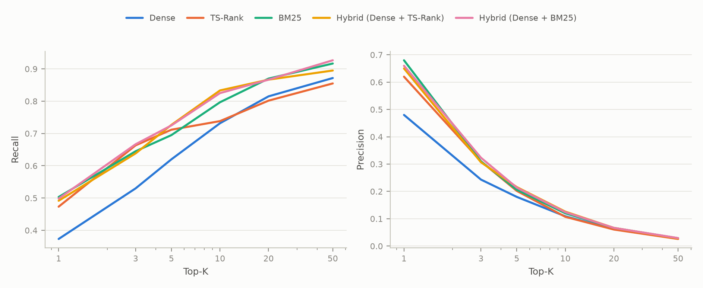
</picture>

Two panels sharing an x-axis of retrieval depth (Top-K = 1, 3, 5, 10, 20, 50, spaced logarithmically). The left panel plots recall, the right plots precision. Each line is one retrieval mode.

These two panels always move in opposite directions: asking for more results can only find more of what you wanted (recall up) while adding more that you did not (precision down). A retriever is therefore a curve, not a point, and one mode beats another by sitting above it on the left panel at the same depth.

Reading it: **dense retrieval (blue) is the lowest recall line at every depth**, and the gap is widest where it matters most — at K=1 it reaches 0.37 against BM25's 0.50. The two hybrids and BM25 are closely grouped above it throughout. On the right panel the ordering is the same: BM25 leads precision at K=1 (0.68 vs dense's 0.48), and by K=10 all five modes have converged to roughly 0.11–0.13. That convergence is a property of the labels, not of the retrievers: at 1.63 relevant chunks per question, precision@10 cannot exceed ~0.163 for any mode, so a depth of 10 is mostly padding and the modes have little room left to differ.

### Ranking: is the order right?

<picture>
  <source media="(prefers-color-scheme: dark)" srcset="assets/eval/png/dark/bge-large/ranking-quality.png">
  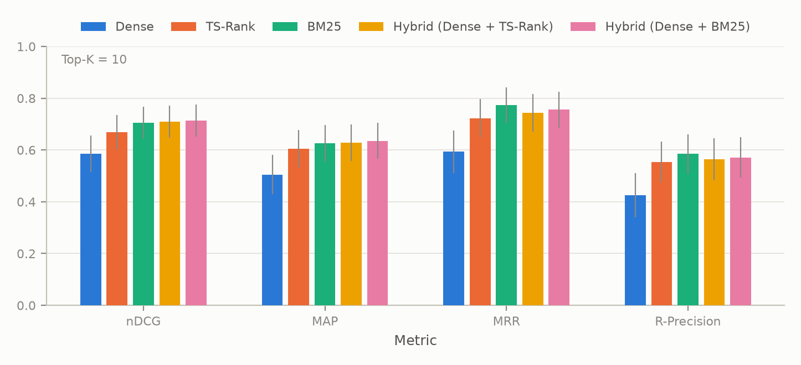
</picture>

Four rank-aware metrics, all at a fixed depth of 10, with five bars each — one per mode. Vertical lines are 95% confidence intervals across the 100 questions.

Recall and precision only ask whether a relevant chunk was returned. These four ask whether it was returned *near the top*: nDCG discounts hits by position, MAP averages precision at each hit, MRR looks only at the first hit, and R-Precision measures precision at a depth equal to the number of truly relevant chunks. Overlapping intervals mean two modes are not distinguishable on this question set.

Reading it: dense is last on all four. The separation is clean on MRR — dense's interval is `[0.51, 0.67]` against BM25's `[0.71, 0.84]`, with no overlap — and marginal on nDCG, where `[0.52, 0.66]` and `[0.64, 0.77]` just touch. The three leaders — BM25, Hybrid (Dense+TS-Rank) and Hybrid (Dense+BM25) — sit well within each other's intervals and cannot be separated here.

MRR separating most cleanly is the specific claim: dense is not merely returning fewer relevant chunks, it is placing the first one further down.

The consistent result across both figures: **on this corpus, lexical retrieval beats dense retrieval, and hybrid does not clearly beat lexical alone.** These are technical papers, where questions and source text share vocabulary — exact-term matching on "SmoothQuant" or "WinoGrande" is precisely what BM25 is good at and what embedding into a semantic neighbourhood blurs.

### Fusion weight

<picture>
  <source media="(prefers-color-scheme: dark)" srcset="assets/eval/png/dark/bge-large/fusion-weight.png">
  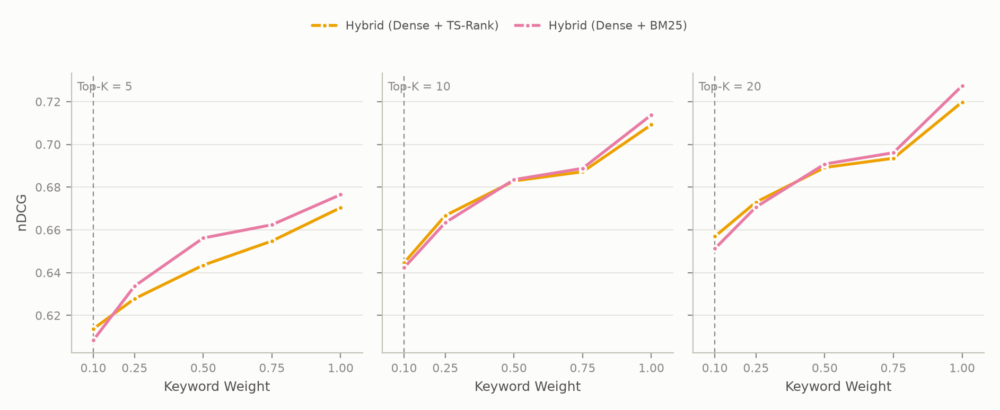
</picture>

Three panels, one per depth (Top-K = 5, 10, 20). The x-axis is the weight given to the lexical ranker when fused with dense retrieval, where 1.0 is equal footing. Two lines are the two hybrid combinations. The dashed vertical line marks 0.1, the value previously configured.

RRF scores a chunk by summing `weight / (k + rank)` over the lists it appears in. The weight decides how much the lexical side can outvote the dense side, so this figure answers "how much should the lexical ranker be trusted relative to dense?"

Reading it: both lines rise monotonically from left to right in all three panels. There is no interior optimum — nDCG is highest at 1.0 everywhere, and the old 0.1 setting is the worst point on every curve.

This follows directly from the previous two figures. At weight 0.1 a rank-1 lexical hit scored below a rank-40 dense hit, so the lexical ranker could never outrank dense anywhere in the pool — the hybrid was dense retrieval with extra steps. Since lexical is the *stronger* ranker here, down-weighting it was backwards. `keyword_weight` is now 1.0.

### Reranking

<picture>
  <source media="(prefers-color-scheme: dark)" srcset="assets/eval/png/dark/bge-large/rerank-matched.png">
  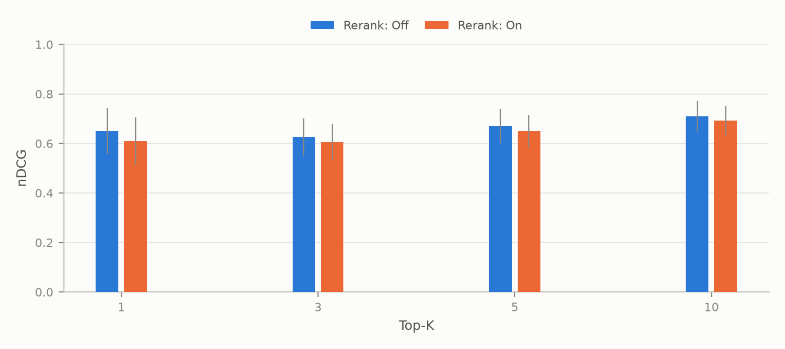
</picture>

nDCG at four depths, with two bars at each: reranking off, and reranking on. Both bars at a given depth return the same number of results, so the comparison is matched — the only difference is whether a cross-encoder (`ms-marco-MiniLM-L-6-v2`) reordered a wider candidate pool down to that depth. The baseline is hybrid retrieval, and the "on" bar is the *best* reranked configuration measured at that depth, across every candidate-pool size swept.

The intervals are genuinely wide at Top-K = 1, where per-question nDCG is either 0 or 1 and nothing averages out. That is the measurement, not a plotting artefact.

Reading it: the reranked bar is **lower** than the un-reranked bar at all four depths — 0.650 vs 0.610 at K=1, 0.709 vs 0.693 at K=10 — though the intervals overlap heavily throughout. The reranker is therefore not distinguishable from a loss, and it is never a gain, even when handed its most favourable pool size.

The reranker is not earning its place on this corpus. It is a general-purpose cross-encoder trained on MS MARCO web queries, applied to technical paper passages, and it is being asked to improve a ranking that lexical matching already got substantially right. It stays off in the evaluated configuration.

### Query transforms

<picture>
  <source media="(prefers-color-scheme: dark)" srcset="assets/eval/png/dark/bge-large/query-arms.png">
  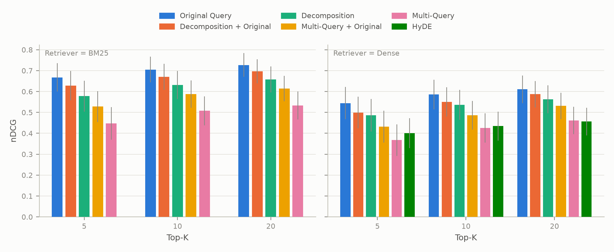
</picture>

Two panels — BM25 on the left, dense on the right — each showing nDCG at three depths, with one bar per query transform:

- **Original Query** — the question, untouched. The baseline.
- **Multi-Query** — three LLM-written paraphrases, retrieved separately, fused with RRF.
- **Decomposition** — the question split into sub-questions, retrieved separately, fused.
- **+ Original** — the same, but with the original question put back into the fusion alongside its rewrites.
- **HyDE** — an LLM writes a hypothetical answer passage, and *that* is embedded instead of the question. Dense only; embedding a passage is meaningless to a lexical ranker, so it is absent from the BM25 panel.

Each transform is a pure function of the question, cached to disk, so the same rewrites are reused across every sweep and every encoder.

Reading it: **Original Query is the tallest bar in every group in both panels.** The ordering is stable — adding the original question back (`+ Original`) always recovers part of the loss, placing those variants between the plain transform and the baseline, and plain Multi-Query is consistently the worst.

None of these techniques helps here. The `+ Original` ordering explains why: the rewrites are actively diluting a query that was already well matched to the corpus. These questions were generated *from* the chunks, so the original question carries the chunk's own vocabulary, and every paraphrase that replaces it trades exact terms for approximate ones. Putting the original back recovers part of the loss precisely because it restores the one query known to be good.

### Latency

<p align="left">
<picture>
  <source media="(prefers-color-scheme: dark)" srcset="assets/eval/png/dark/bge-large/latency-quality.png">
  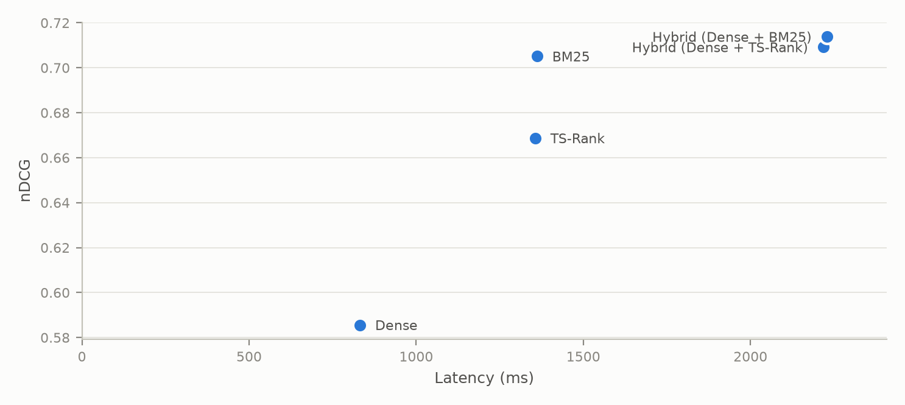
</picture>
<picture>
  <source media="(prefers-color-scheme: dark)" srcset="assets/eval/png/dark/bge-large/latency-breakdown.png">
  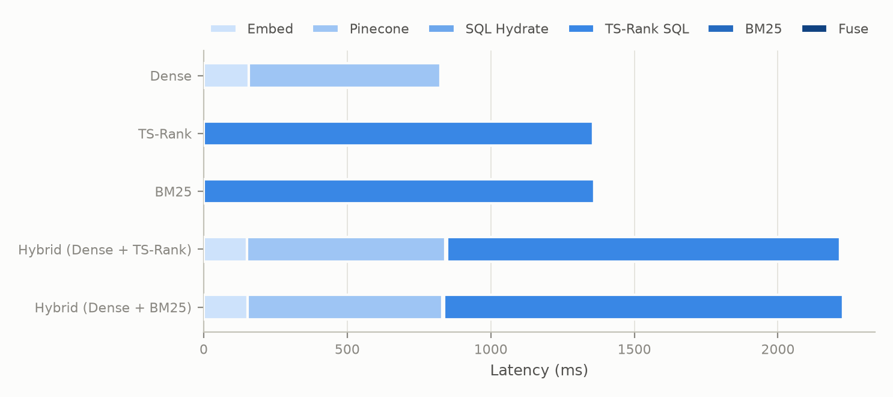
</picture>
</p>

**Left:** a scatter of ranking quality against wall-clock latency, one labelled point per mode. Up is better, left is faster, so the upper-left is the desirable corner and any point below-and-right of another is strictly dominated.

**Right:** the same five modes as stacked horizontal bars, split by pipeline stage — query embedding, the Pinecone round-trip, hydrating rows from Postgres, the lexical SQL query, and fusion.

Reading them together: dense is fastest (~830 ms) and worst-ranked. The hybrids are best-ranked but slowest (~2,220 ms), because the stacked bars show they pay for both paths in sequence — the full dense cost *plus* the full lexical cost. BM25 sits at ~1,360 ms with nDCG within the hybrids' confidence interval.

The breakdown also shows where the time actually goes: for dense, the Pinecone network round-trip is ~670 ms of the ~830 ms total. Local query embedding is ~155 ms and hydrating rows from Postgres is ~4 ms. Neither the embedding model nor the database is the bottleneck — the network is.

BM25 alone is therefore the reasonable operating point: it gives up nothing measurable in ranking quality against the hybrids while removing an external network dependency and ~860 ms.

---

## Answers: the judged branch

The free branch scores whether the right chunks were retrieved. It cannot score whether the answer built from them is any good. That requires generating an answer and having a model grade it.

Four metrics, each scored per question and averaged:

| Metric | Question it answers |
|---|---|
| **Faithfulness** | Is every claim in the answer supported by the retrieved context? |
| **Answer Relevancy** | Does the answer address the question that was asked? |
| **Context Precision** | Of the retrieved chunks, how many were actually useful? |
| **Context Recall** | Of what was needed to answer, how much was retrieved? |

### The baseline, per retrieval target

<picture>
  <source media="(prefers-color-scheme: dark)" srcset="assets/eval/png/dark/bge-large/judged-metrics.png">
  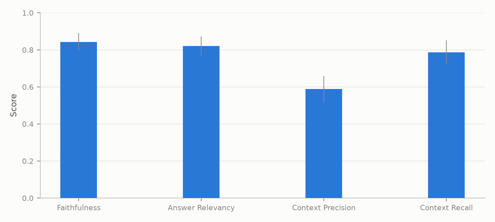
</picture>

The four metrics for one configuration — the untransformed query on bge-large — with 95% confidence intervals across the 100 questions. The figure shows the shape of the result: the two answer-quality metrics sit high (~0.82–0.84) while context precision sits much lower (~0.59).

That gap is structural rather than a defect. Context precision is computed at a retrieval depth of 10 on questions averaging 1.63 relevant chunks, so most of the retrieved context is necessarily unused and the metric is bounded well below 1.0 by construction. It is useful for comparing configurations against each other, and misleading read as an absolute score.

Running the same baseline across all five retrieval targets:

| Target | Faithfulness | Answer Rel. | Ctx. Precision | Ctx. Recall | Recall | nDCG | MAP | MRR |
|---|---|---|---|---|---|---|---|---|
| bge-small | 0.849 | 0.848 | 0.627 | 0.758 | 0.678 | 0.567 | 0.496 | 0.593 |
| bge-large | 0.843 | 0.821 | 0.588 | 0.787 | 0.732 | 0.586 | 0.505 | 0.593 |
| arctic-m-v2 | 0.865 | 0.875 | 0.661 | 0.832 | 0.790 | 0.664 | 0.580 | 0.704 |
| qwen3-0.6b | 0.886 | 0.831 | 0.632 | 0.809 | 0.767 | 0.589 | 0.489 | 0.605 |
| **BM25** | **0.896** | 0.866 | **0.693** | **0.841** | **0.797** | **0.705** | **0.626** | **0.773** |

The left four columns are judged; the right four are the free branch's label-based scores on the same runs.

BM25 leads seven of the eight columns; the exception is answer relevancy, where arctic-m-v2 edges it (0.875 vs 0.866). The two branches agreeing is the more useful observation: a result that survives both a label-based metric and an independent LLM judge is not an artefact of either scoring method.

Among the encoders, a larger model is not reliably better. bge-large scores *below* bge-small on three of the four judged metrics despite being the larger model, and arctic-m-v2 — smaller than bge-large — leads the encoders on seven of eight columns. Encoder choice on this corpus is not a size question.

### Do the query transforms help the answer?

The free branch showed every transform losing ground on retrieval. A reasonable objection is that chunk-id retrieval is the wrong thing to measure — that a transform might retrieve different chunks that are just as good, and the labels would score that as a loss. The judged branch tests exactly that objection.

<p align="left">
<picture>
  <source media="(prefers-color-scheme: dark)" srcset="assets/eval/png/dark/bge-large/judged-query-arms.png">
  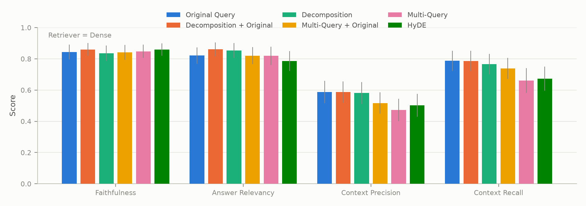
</picture>
<picture>
  <source media="(prefers-color-scheme: dark)" srcset="assets/eval/png/dark/bm25/judged-query-arms.png">
  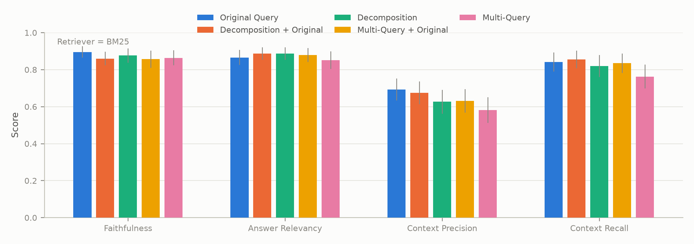
</picture>
</p>

Both figures group the four judged metrics along the x-axis, with one bar per transform inside each group and 95% intervals. **Left** is dense retrieval on bge-large (six transforms); **right** is BM25 (five — HyDE is dense-only). The facet marker in the upper left names the retriever.

Read each metric group left to right and compare against the leftmost bar, which is always the untransformed query.

Reading them: the two answer-quality metrics on the left of each figure are **flat** — every transform's interval overlaps the baseline's on faithfulness and answer relevancy. The two context metrics on the right are **not** flat, and they decline in the same order as the free branch found:

| Transform | Ctx. Precision (dense) | Ctx. Recall (dense) |
|---|---|---|
| Original query | 0.588 | 0.787 |
| Decomposition + Original | 0.587 | 0.786 |
| Decomposition | 0.581 | 0.766 |
| Multi-Query + Original | 0.516 | 0.738 |
| HyDE | 0.502 | 0.672 |
| Multi-Query | 0.473 | 0.661 |

The objection does not hold. The transforms genuinely retrieve worse context, and the judge — which never sees a chunk id — agrees with the labels about it. That the *answer* metrics stay flat while the *context* metrics fall is itself informative: the answerer is absorbing degraded context without the output getting visibly worse, which means faithfulness and answer relevancy alone would have hidden this entirely.

### Where the judge and the labels disagree

<picture>
  <source media="(prefers-color-scheme: dark)" srcset="assets/eval/png/dark/bge-large/judge-vs-labels.png">
  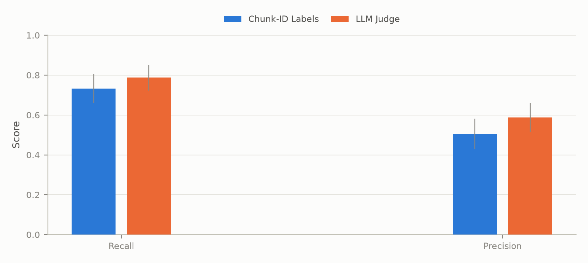
</picture>

Two metric groups, recall and precision, each with two bars: the free branch's score from chunk-id labels, and the judge's nearest equivalent on the same run. Intervals are 95%.

The two bars in each pair approach the same idea by different means. The labels ask "was the chunk this question was generated from retrieved?" The judge asks "was the retrieved text sufficient to answer?" — with no knowledge of which chunk was the source. The pairing is exact for recall (label recall against the judge's context recall) and approximate for precision, where the label side is MAP — a rank-aware precision — against the judge's context precision, which is not rank-aware in the same way. Read the precision pair as indicative rather than a like-for-like difference.

Reading it: **the judge scores higher than the labels in both pairs** — recall 0.79 against 0.73, precision 0.59 against 0.51 — with overlapping intervals in both.

The direction is the expected one and is the reason both branches exist. A question generated from chunk 4,102 can often be answered perfectly well from chunk 4,101, which says the same thing in different words. The labels score that as a miss; the judge scores it as a success. So **the chunk-id labels are a lower bound on true retrieval quality, not an unbiased estimate.** They remain the right tool for comparing configurations, because the bias applies equally to every configuration being compared — but the absolute numbers understate, and the judge is what quantifies by how much. Note the judge's leniency (7 false positives, 0 false negatives) works in the same direction, so the true value likely sits between the two bars rather than at the judge's.

---

## Running the evaluation

```bash
cd services/backend

# Free branch - no LLM, sweep as often as you like.
# a = mode x depth, b = rerank, c = query arms, w = fusion weight, pool = candidate pool
uv run python -m eval.ablations all --timed
uv run python -m eval.ablations c            # just one ablation

# Judged branch - costs API tokens (~$0.19 per 100-question run)
uv run python -m eval.run --mode bm25 --arm none
uv run python -m eval.run --mode semantic --arm hyde
uv run python -m eval.run --mode semantic --arm none --sample 10   # cheap smoke

# Supporting commands
uv run python -m eval.query_arms generate    # write the transform cache (once)
uv run python -m eval.judge_kappa            # judge agreement against human labels
uv run python -m eval.plots --embed-model bge-large   # -> assets/eval/<ext>/<mode>/<model>/
```

`--mode` and `--arm` are validated against each other before any work begins: HyDE embeds a passage, so `--mode bm25 --arm hyde` is rejected rather than silently running a dense search and filing it as BM25.

Results are written to `eval/results/<target>/`, one directory per embedding model, plus `bm25/` for the lexical runs that use no encoder. The split is load-bearing — chunk ids are stable across a re-embed but vectors are not, so a number measured under one encoder is not comparable to one measured under another. A run that uses no encoder records `embed_model: null` rather than naming whichever one happened to be configured.

Raw run output is gitignored scratch; the committed figures and this README are the durable record.

### Tracing

Every judged run is traced to [Phoenix](https://github.com/Arize-ai/phoenix) (`docker-compose` service, http://localhost:6006), which gives one trace per question:

```
arm[multi_query]                 CHAIN      arm, retrieval mode, encoder, top_k
├─ arm.transform[multi_query]    CHAIN      question in, derived queries out
├─ retrieve.sub[0..2]            RETRIEVER  one span per sub-query, with its chunks
├─ retrieve.rrf_fuse             RETRIEVER  the fused result
└─ (answerer LLM call)           LLM
```

Retrieved chunks are attached as OpenInference documents, so which paraphrase found which chunk is visible in the UI rather than only in the results JSON. Spans carry the arm, mode and encoder as attributes, so runs are filterable across a sweep. Tracing is a no-op when `PHOENIX_COLLECTOR_ENDPOINT` is unset.

## Testing

```bash
cd services/backend
uv run pytest                  # fast, mocked - default
uv run pytest -m integration   # real Postgres (disposable container) + real Pinecone (test namespace)

# The eval harness imports ragas, whose executor calls nest_asyncio.apply() at
# import time and poisons the event loop for the TestClient tests - so these
# run in their own process.
uv run pytest -o addopts="" tests/test_eval_run.py tests/test_eval_sampling.py -m eval

cd ../frontend
npm test                       # node --test, no test dependency
```

Anything touching the DB, Pinecone or search has both mocked unit tests for wiring and integration tests against real infrastructure — mocks agreeing with themselves is not evidence the SQL is right. The agent's tests run against recorded replay fixtures, so the suite needs no API key.
